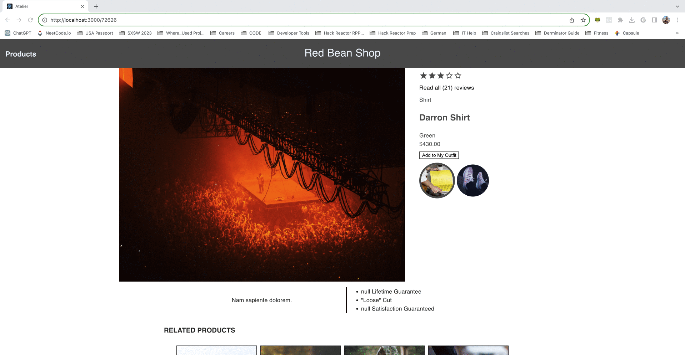

# Red Bean Shop 🌱🔴

## Overview
Red Bean Shop is a server and client-rendered e-commerce web application optimized for Google Lighthouse metrics and SEO. Designed as a front-end project, this application delivers a seamless and fast user experience.

## Table of Contents
1. [Description](#description)
2. [Features](#features)
3. [Installation](#installation)

## Description
Red Bean Shop is built to deliver a high-speed, user-friendly e-commerce experience. The application is optimized for both server-side and client-side rendering, ensuring efficient load times and a smooth user journey from browsing to purchase. Google Lighthouse metrics are used to guarantee that the application meets the highest standards of speed and accessibility. Here's a high-level list of features:

- **Server and Client-Side Rendering**: For optimal speed and SEO.
- **Optimized Performance**: Score of 99 on Google Lighthouse.
- **Product Widgets**: For displaying detailed product information.
- **Dynamic Product Page**: To browse through available products.




## Features
- Efficient server-side and client-side rendering
- High-performance scores on Google Lighthouse


## Installation

To get Red Bean Shop up and running locally on your machine, follow the instructions below:

### Dependencies
- Node.js
- React.js
- Express

### Steps

1. Clone the repository:

```bash
git clone https://github.com/yourusername/RedBeanShop.git

